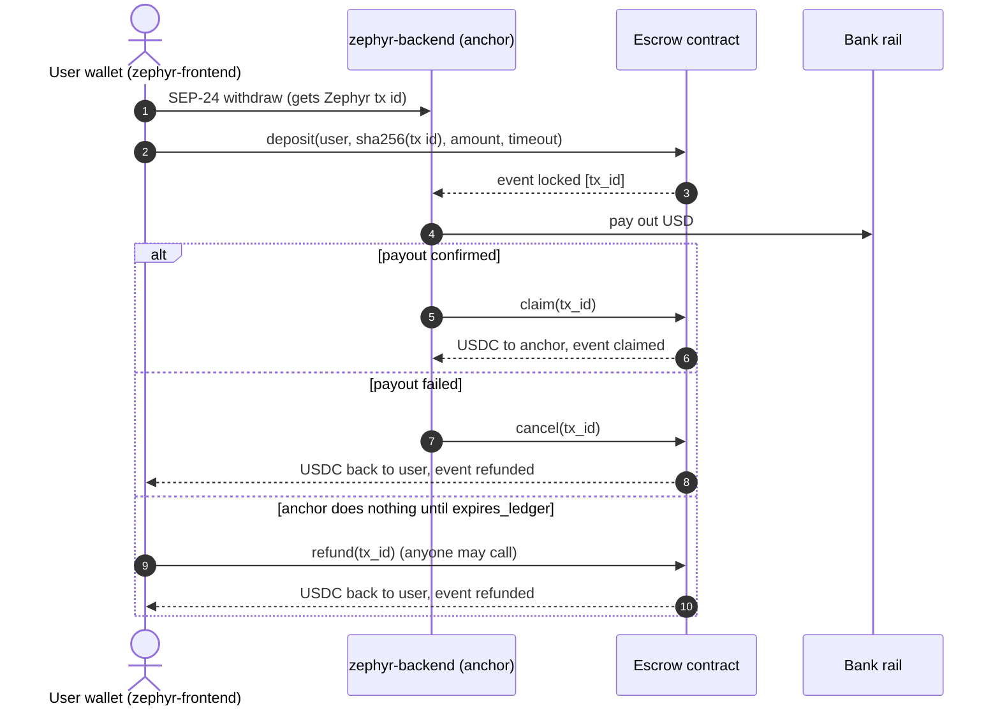
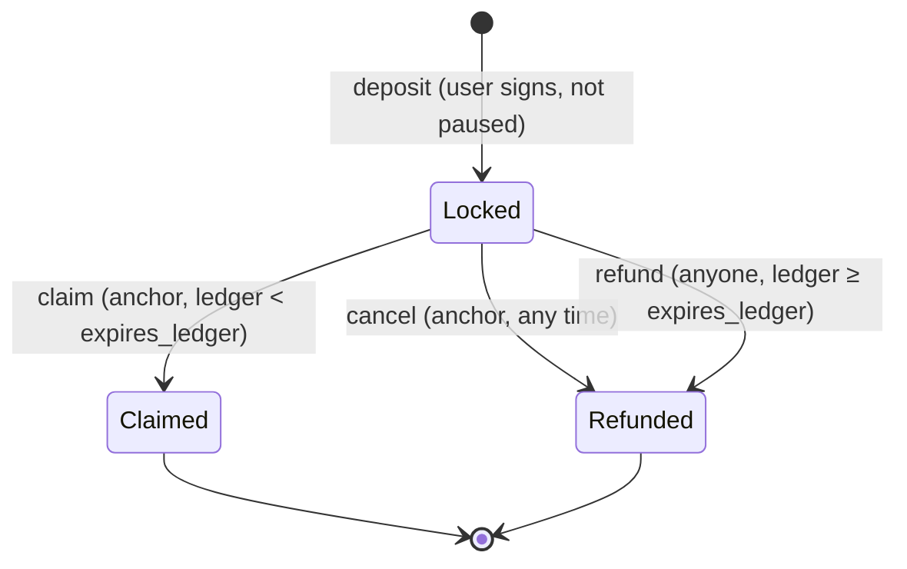

# Zephyr Contracts

[](https://github.com/zephyr-ramp/zephyr-contracts/actions/workflows/ci.yml)
[](LICENSE)


The Soroban **withdrawal escrow** for [Zephyr](https://github.com/zephyr-ramp), an open-source USD ⇄ USDC on/off-ramp on Stellar.

When you cash out USDC through Zephyr, you don't have to trust the anchor with your USDC before you've been paid. You lock it in this contract for one specific withdrawal. The anchor can only take it **after** paying out dollars to your bank. If the anchor doesn't act before the deadline, **anyone** can send it back to you.

> [!WARNING]
> **Unaudited. Testnet only.** This contract has not had a security audit. Do not use it with real funds. The audit is tracked in the issue *"Commission an external security audit of the escrow contract"*.

## Contents

- [How it fits into Zephyr](#how-it-fits-into-zephyr)
- [Quick start](#quick-start)
- [Escrow lifecycle](#escrow-lifecycle)
- [Functions](#functions) · [Errors](#errors) · [Events](#events) · [Storage](#storage-and-ttl)
- [Testnet deployment](#testnet-deployment)
- [TypeScript client](#typescript-client-zephyr-rampescrow-client)
- [Threat model](#threat-model)
- [Roadmap](#roadmap) · [Contributing](#contributing)

## How it fits into Zephyr

| Repo | Role |
|---|---|
| **zephyr-contracts** (this repo) | Escrow contract + the generated `@zephyr-ramp/escrow-client` TypeScript package |
| [zephyr-backend](https://github.com/zephyr-ramp/zephyr-backend) | Anchor server. Watches `locked` events, pays out fiat, then calls `claim`, or `cancel` if the payout fails |
| [zephyr-frontend](https://github.com/zephyr-ramp/zephyr-frontend) | Wallet app. Builds and signs `deposit`, shows escrow status, offers `refund` after expiry |



The link between the two worlds is the `tx_id`: **`sha256` of the Zephyr transaction UUID string** (UTF-8 bytes, as returned by SEP-24). The backend matches `locked` events to its transactions by that hash.

## Quick start

Prerequisites: Rust stable, and [Stellar CLI](https://developers.stellar.org/docs/tools/cli/install-cli) v28.1.0 or newer.

```bash
git clone https://github.com/zephyr-ramp/zephyr-contracts && cd zephyr-contracts
stellar contract build          # builds target/wasm32v1-none/release/zephyr_escrow.wasm
cargo test                      # 47 tests, offline, about a minute
./scripts/deploy-testnet.sh     # optional: your own testnet deployment
./scripts/bindings.sh           # optional: regenerate the TypeScript client
```

`rust-toolchain.toml` makes `rustup` install the `wasm32v1-none` target, `rustfmt` and `clippy` for you. soroban-sdk 28 requires `stellar contract build`: a plain `cargo build --target wasm32v1-none` fails on purpose.

### Script configuration

`scripts/deploy-testnet.sh` reads these optional environment variables:

| Variable | Default | Meaning |
|---|---|---|
| `ADMIN_IDENTITY` | `zephyr-admin` | stellar-cli identity that deploys and administers. Created and funded by friendbot if missing |
| `ANCHOR_IDENTITY` | `zephyr-anchor` | Identity whose address becomes the anchor (created if missing) |
| `ANCHOR_ADDRESS` | *(from `ANCHOR_IDENTITY`)* | Use this `G...` address as the anchor instead, e.g. the backend's distribution account |
| `USDC_ASSET` | `USDC:GBBD47IF6LWK7P7MDEVSCWR7DPUWV3NY3DTQEVFL4NAT4AQH3ZLLFLA5` | Classic asset whose Stellar Asset Contract is escrowed (Circle testnet USDC) |
| `MIN_TIMEOUT_LEDGERS` | `720` | Shortest timeout a user may choose (~1 hour at 5 s/ledger) |
| `MAX_TIMEOUT_LEDGERS` | `120960` | Longest timeout a user may choose (~7 days) |

`scripts/bindings.sh` reads `LOCAL_ONLY=1` to generate from the local wasm instead of the deployed contract. `scripts/github-setup.sh` creates this repo's labels and issues with `gh` (`DRY_RUN=1` to preview).

The script refuses to run with the same account as admin and anchor. Keep them separate: the admin key should live offline, while the anchor key is used by the backend.

## Escrow lifecycle



- `expires_ledger = deposit ledger + timeout_ledgers`.
- **Exactly at** `expires_ledger` the anchor can no longer claim and the escrow becomes refundable. There is no ledger where both, or neither, are possible.
- `Claimed` and `Refunded` are final. A settled `tx_id` can never be reused.

## Functions

| Function | Auth | Behaviour |
|---|---|---|
| `initialize(admin, anchor, token, min_timeout, max_timeout)` | none (once) | Stores config. `AlreadyInitialized` on a second call. `InvalidTimeout` unless `0 < min ≤ max ≤ network max TTL` |
| `deposit(user, tx_id, amount, timeout_ledgers)` | `user` | Requires not paused, `amount > 0`, `min ≤ timeout ≤ max` and an unused `tx_id`. Records the escrow, then transfers `amount` from `user`. Emits `locked` |
| `claim(tx_id)` | anchor | Only when `Locked` and `ledger < expires_ledger`. Sets `Claimed`, then pays the anchor. Emits `claimed` |
| `cancel(tx_id)` | anchor | Only when `Locked`, at any time. Sets `Refunded`, then pays the user. Emits `refunded` with `by_anchor: true` |
| `refund(tx_id)` | **none** | Only when `Locked` and `ledger ≥ expires_ledger`. Sets `Refunded`, then pays the user (always the original user). Emits `refunded` with `by_anchor: false`. **Works while paused** |
| `get_escrow(tx_id)` | none | Returns the `Escrow`, or `NotFound` |
| `get_config()` | none | Returns the `Config`, or `NotInitialized` |
| `set_anchor(anchor)` | admin | Changes who can claim/cancel, including for existing `Locked` escrows |
| `set_timeouts(min, max)` | admin | Changes bounds for **new** deposits. Existing `expires_ledger`s are unchanged |
| `pause()` / `unpause()` | admin | Blocks / re-allows `deposit` **only**. `claim`, `cancel` and `refund` keep working |
| `upgrade(wasm_hash)` | admin | Replaces the contract code. Storage is kept |

Amounts are `i128` in the token's smallest unit (stroops; USDC has 7 decimals, so `1 USDC = 10_000_000`).

### Types

```rust
struct Escrow { user: Address, amount: i128, created_ledger: u32, expires_ledger: u32, status: EscrowStatus }
enum EscrowStatus { Locked, Claimed, Refunded }
struct Config { admin: Address, anchor: Address, token: Address,
                min_timeout_ledgers: u32, max_timeout_ledgers: u32, paused: bool }
```

## Errors

Codes are stable. Clients map them to messages, so they are never renumbered.

| Code | Name | When |
|---|---|---|
| 1 | `AlreadyInitialized` | `initialize` called twice |
| 2 | `NotInitialized` | Any call before `initialize` |
| 3 | `InvalidAmount` | `amount ≤ 0` |
| 4 | `InvalidTimeout` | Timeout outside `[min, max]`, or invalid bounds |
| 5 | `DuplicateTxId` | `tx_id` already used (in any status) |
| 6 | `NotFound` | No escrow for `tx_id` |
| 7 | `NotLocked` | Escrow already `Claimed` or `Refunded` |
| 8 | `Expired` | `claim` at or after `expires_ledger` |
| 9 | `NotExpired` | `refund` before `expires_ledger` |
| 10 | `Paused` | `deposit` while paused |

Auth failures surface as host auth errors, not contract errors.

## Events

Events use soroban-sdk `#[contractevent]`: the first topic is the event name, the data is a map of the remaining fields.

| Event | Topics | Data |
|---|---|---|
| `locked` | `["locked", tx_id]` | `{ user, amount, expires_ledger }` |
| `claimed` | `["claimed", tx_id]` | `{ anchor, amount }` |
| `refunded` | `["refunded", tx_id]` | `{ user, amount, by_anchor }` |
| `initialized` | `["initialized"]` | `{ admin, anchor, token }` |
| `anchor_updated` | `["anchor_updated"]` | `{ anchor }` |
| `timeouts_updated` | `["timeouts_updated"]` | `{ min_timeout_ledgers, max_timeout_ledgers }` |
| `paused_changed` | `["paused_changed"]` | `{ paused }` |
| `upgraded` | `["upgraded"]` | `{ wasm_hash }` |

The backend subscribes with Soroban RPC `getEvents`, filtering on this contract ID and the first topic.

## Storage and TTL

| Storage | Key | Value | TTL policy |
|---|---|---|---|
| Instance | `Config` | `Config` | Extended to 30 days on every state-changing call |
| Persistent | `Escrow(tx_id)` | `Escrow` | On every write, extended to `(expires_ledger − now) + 30 days`, capped at the network max TTL |

So an active escrow stays live for 30 days past its expiry, which gives the user a month to call `refund`. Settled escrows stay readable for 30 days so indexers can catch up, and their `tx_id` stays reserved. `max_timeout` can't exceed the network max TTL, so an escrow can never be archived before it expires. If an entry is ever archived, it can be restored with `stellar contract restore`, and the funds are not lost.

## Testnet deployment

| | |
|---|---|
| Escrow contract | [`CCQCVQTYB45FXJG6BPLR4RPBMBOE4VD73MUMTDWT6Q55TXINSEBV3IOQ`](https://stellar.expert/explorer/testnet/contract/CCQCVQTYB45FXJG6BPLR4RPBMBOE4VD73MUMTDWT6Q55TXINSEBV3IOQ) |
| Token (USDC SAC) | [`CBIELTK6YBZJU5UP2WWQEUCYKLPU6AUNZ2BQ4WWFEIE3USCIHMXQDAMA`](https://stellar.expert/explorer/testnet/contract/CBIELTK6YBZJU5UP2WWQEUCYKLPU6AUNZ2BQ4WWFEIE3USCIHMXQDAMA) |
| Wasm hash | `1ab76abd126323f4361bfebea1d6ee2ab56b19b86c53edf75c89f144cde52f44` |
| Admin | `GDPUX6JJNDRAWPA2EDERIICH57GSYNCMEBMB4XMIISW462BGIKOIR6DT` |
| Anchor | `GA4BL5DT7PVYKWXANEWKQIIBVE7GJ5WSXY4ZSXQRSHB26BWHPU4O2ANQ` |
| Timeouts | 720 – 120,960 ledgers (~1 hour – ~7 days) |

Machine-readable: [`deployments/testnet.json`](deployments/testnet.json). Testnet is reset periodically. If the contract disappears, run `./scripts/deploy-testnet.sh` and update this table.

### Try it from the CLI

```bash
# Read-only calls are simulated (--send=no), but still need any identity as --source
stellar contract invoke --id CCQCVQTYB45FXJG6BPLR4RPBMBOE4VD73MUMTDWT6Q55TXINSEBV3IOQ --network testnet --source me --send=no -- get_config

# Lock 1 USDC for 1 hour. Your identity needs a USDC trustline and balance.
TX_ID=$(printf '%s' "your-zephyr-transaction-uuid" | sha256sum | cut -d' ' -f1)
stellar contract invoke --id CCQCVQTYB45FXJG6BPLR4RPBMBOE4VD73MUMTDWT6Q55TXINSEBV3IOQ --network testnet --source me -- \
  deposit --user me --tx_id "$TX_ID" --amount 10000000 --timeout_ledgers 720

stellar contract invoke --id CCQCVQTYB45FXJG6BPLR4RPBMBOE4VD73MUMTDWT6Q55TXINSEBV3IOQ --network testnet --source me --send=no -- get_escrow --tx_id "$TX_ID"
```

## TypeScript client (`@zephyr-ramp/escrow-client`)

`bindings/` is generated by `stellar contract bindings typescript` and committed, built, so the backend and frontend can install it without a Rust toolchain:

```bash
# From npm, once published (see .github/workflows/publish-bindings.yml)
npm install @zephyr-ramp/escrow-client
# Or from a local checkout / packed tarball
npm install ../zephyr-contracts/bindings
```

zephyr-backend and zephyr-frontend vendor a packed tarball (`vendor/zephyr-ramp-escrow-client-*.tgz`), so their installs work offline. After changing the contract interface, run `npm run bindings:update` in each app. The package depends on `@stellar/stellar-sdk` ^17.1.0 (set in `scripts/bindings.sh`) so the apps bundle a single SDK.

```ts
import { Client, networks } from "@zephyr-ramp/escrow-client";

const escrow = new Client({
  ...networks.testnet,                          // contractId + networkPassphrase
  rpcUrl: "https://soroban-testnet.stellar.org",
  publicKey: userAddress,
  signTransaction,                              // e.g. from Stellar Wallets Kit
});

const tx = await escrow.deposit({
  user: userAddress,
  tx_id: Buffer.from(await sha256(zephyrTxId)),  // 32 bytes
  amount: 25_0000000n,                           // 25 USDC as i128 stroops
  timeout_ledgers: 17_280,                       // ~1 day
});
await tx.signAndSend();
```

## Threat model

Trust assumptions, what each party can and can't do, and what protects users.

**Malicious or compromised anchor key**
- *Can:* claim any `Locked` escrow before it expires **without** paying out fiat. This is the core trust the user still places in the anchor, and it is bounded by the escrow timeout. It can also `cancel` escrows, which only returns funds to users.
- *Can't:* move funds anywhere except to the anchor address in config (on `claim`) or to the escrow's original user. It can't claim after expiry, touch funds of unrelated contracts, or change config.
- *Mitigations:* keep timeouts short so users aren't exposed for long; the backend claims only after the rail confirms payout; every claim is an on-chain event that can be audited against payout records. Rotate a compromised key with `set_anchor`.

**Malicious user**
- *Can:* lock funds and never complete the fiat side (the anchor just `cancel`s, or it expires); spam deposits (each costs them fees and locked capital); front-run a `tx_id` by depositing under someone else's Zephyr transaction hash.
- *Can't:* get funds back while the escrow is `Locked` and unexpired, refund someone else's escrow to themselves (refunds always go to the recorded `user`), or double-spend a `tx_id`.
- *Mitigations:* the backend must check that the `locked` event's `user` and `amount` match the Zephyr transaction before paying out. Mismatches go to `error` for manual review, never auto-pay. A squatted `tx_id` only blocks that one withdrawal, and the real user can start a new one.

**Admin key loss or compromise**
- *Lost:* no pause, anchor rotation or upgrades, but every existing flow keeps working. Users can always `refund`.
- *Compromised:* the attacker can `upgrade` to arbitrary code, and **that can take every escrowed fund**. This is the largest trust assumption. Before mainnet the admin must be a multisig or a timelocked governance contract (see roadmap). They can also `set_anchor` to themselves and claim unexpired escrows.

**Paused contract**
- Pausing blocks **only** `deposit`. `claim`, `cancel` and `refund` are deliberately unaffected, so a pause can never trap funds. Tests assert this.

**Other considerations**
- *Initialisation front-running:* `initialize` is a separate transaction from deploy, so someone could initialise first with their own admin. `deploy-testnet.sh` reads the config back and aborts if it isn't ours. Moving to a `__constructor` removes the window (roadmap).
- *Token behaviour:* the token is fixed at initialise and expected to be the USDC Stellar Asset Contract. Fee-on-transfer or rebasing tokens are not supported.
- *Direct transfers:* anyone can send tokens straight to the contract address. They aren't tracked by any escrow and are stuck. The invariant "balance equals sum of `Locked`" holds for contract-mediated flows (property-tested), and the balance can only be **higher** than that sum.
- *Checks-effects-interactions:* every function writes the new status before calling the token contract.

## Tests

`cargo test` runs 47 tests in the in-process Soroban host:

- happy paths for every function, with exact event assertions;
- every error code;
- auth for each role (`env.auths()` checks, and `mock_auths` with the wrong signer);
- expiry boundaries (one before, exactly at, and one after `expires_ledger`) for `claim` and `refund`;
- double claim, double refund, and reuse of settled `tx_id`s;
- refunds, claims and cancels while paused;
- TTL of active escrows;
- a real `upgrade` using the built wasm;
- a **property test** (proptest) that runs random sequences of deposit/claim/cancel/refund/advance/pause and checks after every step that the contract balance equals the sum of `Locked` escrows, and that no tokens are created or destroyed.

## Roadmap

- [x] Escrow contract with claim/cancel/refund, pause and upgrade
- [x] Property test for the balance invariant
- [x] Testnet deployment and TypeScript bindings
- [ ] External security audit
- [ ] Replace `initialize` with `__constructor` to close the init front-running window
- [ ] Multisig / timelocked admin before any mainnet deployment
- [ ] Publish `@zephyr-ramp/escrow-client` to npm
- [ ] CI check that committed bindings match the contract interface
- [ ] Gas/resource benchmarks per function
- [ ] Batch `claim` for high-volume anchors

## Contributing

Read [CONTRIBUTING.md](CONTRIBUTING.md). Pick an issue labelled `good first issue` or `help wanted`, and **wait to be assigned** before starting. Zephyr takes part in the [Drips Wave](https://www.drips.network/wave) program, so Wave issues earn points (Trivial 100 / Medium 150 / High 200).

Security issues: see [SECURITY.md](SECURITY.md). Never use public issues for them.

## License

[Apache-2.0](LICENSE)
